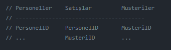
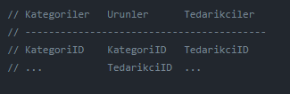

# Joinler

## Inner Join Yapısı

İlişkili tabloları birleştirmek için kullanılır. Her iki tablodaki ortak kayıtları döndürür. İki kümenin kesişimidir.

```sql
CREATE TABLE Ders
(
DersID INT PRIMARY KEY,
DersAd NVARCHAR(10)
)

CREATE TABLE Ogrenci
(
OgrNo INT UNIQUE,
OgrAd NVARCHAR(10),
DersID INT FOREIGN KEY REFERENCES Ders(DersID)
)

SELECT * FROM Ders D INNER JOIN Ogrenci O ON D.DersID = O.DersID
SELECT * FROM Ders D INNER JOIN Ogrenci O ON O.DersID = D.DersID
SELECT * FROM Ogrenci O INNER JOIN Ders D  ON O.DersID = D.DersID

USE Northwind

-- Örnek 1
SELECT * FROM Personeller INNER JOIN Satislar ON Personeller.PersonelID = Satislar.PersonelID

-- Örnek 2
SELECT * FROM Satislar INNER JOIN Personeller ON Personeller.PersonelID = Satislar.PersonelID

-- Tablolara Alias(AS) tanımlama
SELECT * FROM Personeller P INNER JOIN Satislar S ON P.PersonelID = S.PersonelID

-- Inner join de Where Şartı Yazma
SELECT * FROM Personeller P INNER JOIN Satislar AS S ON P.PersonelID = S.PersonelID
WHERE UnvanEki = 'Mr.' AND SoyAdi ='King'

-- Örnekler

-- Hangi personel hangi satışları yapmıştır? (Personeller, Satislar)
SELECT * FROM Personeller INNER JOIN Satislar ON Personeller.PersonelID = Satislar.PersonelID

-- Hangi ürün hangi kategoridedir? (Urunler, Kategoriler)
SELECT UrunAdi, KategoriAdi FROM Urunler INNER JOIN Kategoriler ON Urunler.KategoriID = Kategoriler.KategoriID

-- Beverages kategorisinde kaç ürün vardır? (Urunler, Kategoriler)
SELECT COUNT(*) FROM Urunler INNER JOIN Kategoriler ON Urunler.KategoriID = Kategoriler.KategoriID WHERE KategoriAdi = 'Beverages'

-- Seafood kategorisindeki ürünlerin listesi nedir? (Urunler,Kategoriler)
SELECT UrunAdi FROM Urunler AS U INNER JOIN Kategoriler AS K ON U.KategoriID = K.KategoriID WHERE KategoriAdi = 'Seafood'
```

### Inner Join İle Birden Fazla Tabloyu Birleştirme



```sql
-- 1997 Yılından sonra Nancy kişisinin satış yaptığı firmaların isimleri nelerdir? (Personeller, Satışlar, Musteriler)
SELECT * FROM Personeller P INNER JOIN Satislar S ON P.PersonelID = S.PersonelID
INNER JOIN Musteriler M ON S.MusteriID = M.MusteriID
WHERE P.Adi = 'Nancy' AND YEAR(S.SatisTarihi) > 1997
```



```sql
-- Limited şirket olan tedarikçilerden alınmış seafood kategorisindeki ürünlerin toplam satış tutarı nedir? (Kategoriler, Urunler, Tedarikciler)
SELECT SUM(U.HedefStokDuzeyi * U.BirimFiyati) FROM Kategoriler K INNER JOIN Urunler U ON K.KategoriID = U.KategoriID
INNER JOIN Tedarikciler T ON U.TedarikciID = T.TedarikciID
WHERE T.SirketAdi LIKE '%Ltd.%' AND K.KategoriAdi = 'Seafood'
```

 
