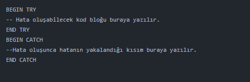

# Programlama Yapıları

## Sql'de Değişken Tanımlama

Değişken tanımlamayı ve değişkene değer atamayı birlikte çalıştırmalısız!

```sql
USE Northwind

-- Değişken tanımlama örnekleri
DECLARE @x INT
DECLARE @a INT , @b NVARCHAR(5)

-- Değişken tanımlamayı ve değişkene değer atamayı birlikte çalıştırmalısız!
DECLARE @y INT = 100
PRINT @y

-- SET Komutu Kullanarak Değişkene Değer Atama
DECLARE @x INT
SET @x = 400
PRINT @x

DECLARE @x INT = 200
PRINT @x -- Çıktı: 200
SET @x = 400
PRINT @x -- Çıktı: 400

-- Select komutu kullanarak değişkene değer atama
DECLARE @enYuksekFiyat  MONEY
SELECT @enYuksekFiyat = 23754.78
PRINT @enYuksekFiyat

-- Sorgu sonucu gelen verileri değişkenlere atama
-- Kurallar:
-- 1. Kural: Sorgu sonucu gelen satır sayısı 1 olmalıdır.
-- 2. Kural: Kolonlardaki veri tipleri ne ise değişkenlerinde veri tipi o olmalıdır.

DECLARE @Isim NVARCHAR(MAX) , @SoyIsim NVARCHAR(MAX)
SELECT @Isim = Adi , @SoyIsim = SoyAdi FROM Personeller WHERE PersonelID = 7

SELECT @Isim , @SoyIsim
SELECT 'İlgili personelin adı - Soyadı: ' + @Isim + ' ' + @SoyIsim
```

## Birleşik Operatörler

Birleşik operatörler, bir değişkenin değerini bir değer ile işleme sokup; geri tekrar aynı değişkenin üzerine yazan operatörlerdir.

```sql
DECLARE @sayac int = 0
SET @sayac += 7 -- @sayac = @sayac + 7
SELECT @sayac As Arti_7 -- Çıktı: 7
SET @sayac -= 2 -- @sayac = @sayac - 7
SELECT @sayac As Eksi_2 -- Çıktı: 5
SET @sayac *= 10 -- @sayac = @sayac * 7
SELECT @sayac As Carpı_10 -- Çıktı: 50
SET @sayac /= 5 -- @sayac = @sayac / 7
SELECT @sayac As Bolü_5 -- Çıktı: 10
SET @sayac %= 8 -- @sayac = @sayac % 7
SELECT @sayac As Mod_8 -- Çıktı: 2
```

## Go Komutu

Öncesini veya kendinden önceki GO komutuna kadar olan kısmı tek seferde çalıştırarak tek bir execution plan olarak SQL Server'a gönderirir. GO komutundan önce tanımlanan bir değişken GO komutundan sonra kullanılamaz. Çünkü go komutu daha önceki kod yığınının sona erdiğini belirtmektedir.

```sql
-- Örnek 1 - Aşağıadaki örnekte veritabanı bulunamadı şeklinde hata fırlatır. Çünkü
-- bu işlemler iki ayrı işlemdir ve editöre bunu go komutu ile ifade etmemiz gerekir.
CREATE DATABASE OrnekDB
USE OrnekDB

CREATE DATABASE OrnekDB
GO
USE OrnekDB

-- Örnek 2
CREATE DATABASE OrnekDB
GO
USE OrnekDB
GO
CREATE TABLE OrnekTablo
(
kolon1 INT,
kolon2 NVARCHAR(5)
)
GO
INSERT INTO OrnekTablo(kolon1) VALUES (100)
GO
SELECT * FROM OrnekTablo

-- Örnek 3 - Aşağıdaki işlem hatalıdır. Çünkü değişken başka bir planda tanımlanmış,
-- ekrana bastırma işlemi ise başka bir planda tanımlanmıştır.
DECLARE @x INT = 5
GO
PRINT @x
```

## If-Else Yapısı

```sql
-- Tek Satırlı  If-Else Yapısı
DECLARE @Ad NVARCHAR(MAX) = 'Alperen'
IF @Ad = 'Alperen'
	PRINT 'İsim Alperen'
ELSE
	PRINT 'İsim Alperen deil'

-- Çok satırlı  If-Else Yapısı
DECLARE @Ad NVARCHAR(MAX) = 'Alperen'
IF @Ad = 'Alperen'
	BEGIN
		PRINT 'İsim Alperen'
		PRINT 'İf bloğundayım.'
	END
ELSE
	BEGIN
		PRINT 'İsim Alperen deil'
		PRINT 'Else bloğundayım.'
	END
```

## While Döngüsü

```sql
DECLARE @Sayac INT = 0
WHILE @Sayac < 100
    BEGIN
	PRINT @Sayac
	SET @Sayac = @Sayac + 1
    END
```

## Break Komutu

Break komutu döngüyü sonlandırır.

```sql
-- Örnek 1
DECLARE @Sayac INT = 0
WHILE @Sayac < 100
	BEGIN
		PRINT @Sayac
		SET @Sayac = @Sayac + 1
		IF @Sayac > 50
			BREAK
	END

-- Örnek 2
DECLARE @Sayac INT = 0
WHILE @Sayac < 100
	BEGIN
		PRINT @Sayac
		SET @Sayac = @Sayac + 1
		IF @Sayac > 50
			BEGIN
			PRINT 'Döngü BREAK komutu ile sonlandırıldı...'
			BREAK
			END
	END
```

## Continue Komutu

Continue komutu bir sonraki iterasyon için döngünün başına atlar.

```sql
DECLARE @Sayac INT = 0
WHILE @Sayac < 100
	BEGIN
		SET @Sayac = @Sayac + 1
		IF @Sayac % 5 = 0
				CONTINUE  -- Dögünün başına atar.
		PRINT @Sayac
	END
```

## Case Kullanımı

```sql
-- Örnek 1
SELECT Adi , SoyAdi ,KıdemBilgisi =
CASE
WHEN BagliCalistigiKisi < 2 THEN 'Üst Kademe Çalışan'
WHEN BagliCalistigiKisi >= 2 AND BagliCalistigiKisi < 5 THEN 'Orta Kademe Çalışan'
WHEN BagliCalistigiKisi >= 5 THEN 'Alt Kademe Çalışan'
ELSE
'Kıdemi Bilinmeyen Çalışan'
END
FROM Personeller

-- Örnek 2
USE Db_Education

CREATE TABLE PersonelBilgi
(
PerAd NVARCHAR(20),
PerSoyad NVARCHAR(20),
Dept NVARCHAR(20),
Ucret INT
)

INSERT PersonelBilgi VALUES ('Alperen', 'Bektaşoğlu', 'IT', '5000')
INSERT PersonelBilgi VALUES ('Gökçen', 'Bektaşoğlu', 'IT', '8000')
INSERT PersonelBilgi VALUES ('Ezgi', 'Demir', 'IT', '2000')

SELECT * FROM PersonelBilgi

UPDATE PersonelBilgi SET Ucret = CASE
WHEN Ucret < 5000 THEN Ucret + 750
WHEN Ucret = 5000 THEN Ucret + 1000
WHEN Ucret > 5000 THEN Ucret + 1250
END
```

## Exists / Not Exists Fonksiyonu

- İfadeyi boolean bir değere döndürür.

```sql
USE Northwind

IF EXISTS(SELECT * FROM Personeller)
	PRINT 'DOLU'
ELSE
	PRINT 'BOŞ'

IF NOT EXISTS(SELECT * FROM Personeller)
	PRINT 'DOLU'
ELSE
	PRINT 'BOŞ'
```

- Exists ve not exists ifadeleri de alt sorgudan getirilen değerlerin içerisinde bir değerin olması veya olmaması durumunda işlem yapılmasını sağlar. "EXIST" kullanımı "IN" kullanımı ile aynı sonucu verir. "NOT EXIST" kullanımı "NOT IN" kullanımı ile aynı sonucu verir.

```sql
USE Northwind

INSERT Personeller(Adi, SoyAdi) VALUES ('Alperen', 'Bektaşoğlu')

-- EXISTS Örneği: Satışlar tablosunda PersonelID'si bulunan personelleri Personeller tablosundan getirir. (Satış yapan personelleri getir.)
SELECT * FROM Personeller AS P WHERE
EXISTS(SELECT * FROM Satislar AS S WHERE P.PersonelID = S.PersonelID)

-- IN Örneği:
SELECT * FROM Personeller WHERE PersonelID IN (SELECT PersonelID FROM Satislar)

-- NOT EXISTS Örneği: Satışlar tablosunda PersonelID'si bulunmayan personelleri Personeller tablosundan getirir. (Satış yapmayan personelleri getir)
SELECT * FROM Personeller AS P WHERE
NOT EXISTS(SELECT * FROM Satislar AS S WHERE P.PersonelID = S.PersonelID)

--NOT IN Örneği:
SELECT * FROM Personeller WHERE PersonelID NOT IN (SELECT PersonelID FROM Satislar)

DELETE FROM Personeller WHERE Adi = 'Alperen'
```

## Tablo Tipi Değişkenler

```sql
USE Db_Education

DECLARE @tabloTipiDegisken TABLE(
	Numara TINYINT IDENTITY(1,1),
	Isim VARCHAR(20)
)
INSERT INTO @tabloTipiDegisken VALUES ('Ali')
INSERT INTO @tabloTipiDegisken VALUES ('Veli')

SELECT * FROM @tabloTipiDegisken
```

## Try-Catch Yapısı



```sql
BEGIN TRY
    SELECT Islem = 255/0
END TRY
BEGIN CATCH
    SELECT [HataSatırı] = ERROR_LINE(),  -- Hatanın Oluştuğu Satır
           [HataNumarasi] = ERROR_NUMBER(), -- Hata Numarası
           [HataÖnemi] = ERROR_SEVERITY(), -- Hata Derecesi
           [HataDurumu] = ERROR_STATE(), -- Hatanın Kod Değeri / Veri tabanı motoru durumu için dahili durum kodu
           [HataMesajı] = ERROR_MESSAGE(), -- Hata Mesajı
           [ProsedürIsmi] = ERROR_PROCEDURE() -- Eger hata bir stored procedure içinde olustu ise onun adını döndürür.
END CATCH
```

ERROR_SEVERITY() fonksiyonunda hata dereceleri aşağıdaki gibidir:

- 0 veya 10 : Kullanıcı veri girişinden kaynaklanan hatalar
- 11-16 arası: Kullanıcının düzeltebileceği hatalar
- 17 : Yetersiz kaynak hataları (Diskin dolu olması ya da tablonun salt okunur olması gibi)
- 18 : Yazılımdan kaynaklanan hatalar
- 19 : Constraintlere takılan hatalar
- 20-25 arası: Kritik hatalar
