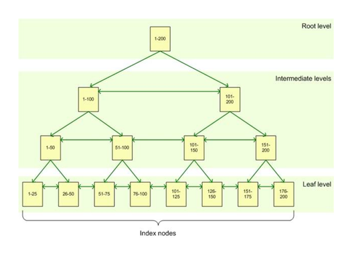

# Indexes

## Index Nedir?

* Indexler hakkında klasik bir örnek olarak telefon rehberi verilebilir. Telefon rehberindeki kayıtların sıralı olmaması durumunda(index olmayan bir tablo) arayacağımız bir isim için(select sorgusu) tüm rehberi gezmemiz gerekecek. (Table Scan) İkinci durumda ise telefon rehberinin isme göre sıralı olduğunu düşünelim. (index olan bir tablo) Bu durumda biliyorum ki Mehmet M harfinde. Kabaca rehberin ortasına gelirim. Ve oradaki harfe bakarak ileriye ya da geriye gitmem gerektiğine karar veririm. Yani bir önceki duruma göre çok çok daha hızlı bir şekilde Mehmet’i bulabilirim. Bu şekilde aradığımız veri veya verilere, eleme yöntemi ile bir kaç adımda ulaşabiliriz. Bu örnekteki gibi verinin sıralı tutulmasını sağlayan yapılara index denir.
* İndexler tablolarda ki verileri fiziksel veya mantıksal olarak sıralar. 
* SQL Server açısından index kullanımının en önemli amacı, istenen bilginin daha az veri okuyarak daha kısa zamanda getirilmesini sağlamaktır.

## Indexlerin Çalışma Prensibi

* Index’lerin nasıl çalıştığına değineceğiz. Ama öncelikle Sql Serverda verilerin nasıl tutulduğuna bakalım. Veriler fiziksel olarak veri dosyalarında(.mdf/.ndf uzantılı dosya) tutulur. SQL Server’de database’lere ait fiziksel dosya isim ve konumları master database ‘de kayıt edilir. Sql Server bu veri dosyalarını fiziksel olarak değil mantıksal olarak 8 KB’lık bloklara böler. Bu bloklara <Page> denir. Bundan dolayı bu veri dosyalarının ilk 8 KB’ı <page0>, bir sonraki 8 KB’ı <page1> şeklinde devam eder. Yani SQL Server her 1MB data için 128 adet page içerir. Sql Server, bir sorgu sonucu bir veriye ulaşırken, aslında tablodaki satırları okumaz bunun yerine page’leri okuyarak verilere ulaşır.

* 8 adet Page’in oluşturduğu gruba <Extent> denilir.

* Sql Server, bir veriyi indexsiz bir tabloya eklerken sıralı olarak diskte tutmaz ve eklenen veri rastgele boş olan bir page’e yazılır. Bir veri sadece bir page içinde olabilir. Bir veri arandığında; Sql Server tablonun kayıtlarına, pagelere bakarak sırayla erişir ve aranılan kayıt ile eşleştirir. Kayıt bulunsa bile eşleşebilecek başka kayıt var mı diye tüm kayıtlarda karşılaştırma işlemi yapar. Sql Server’ın yaptığı bu işleme Table Scan(Tablo Tarama) denir. Bu işlem tablodaki kayıt sayısına göre çok uzun zaman alabilir. Özetle Indexsiz bir tablodan veri arandığı zaman, verinin bulunması için Sql Server’ın arka tarafta table scan tarama yaptığını ve tablodaki veri miktarı arttığı zaman, table scan işleminin perfomansının(zaman açısından) kötüleştiğini söyleyebiliriz.

* Indexler B-tree(Balance Tree) yapısında çalışırlar.

## B-tree(Balance Tree) Yapısının Çalışma Mantığı



Tablodaki kolon veya kolonlara index tanımlandığı zaman, Sql Server o tablodaki verileri aşağıdaki gibi bir Balanced Tree yapısına göre organize eder. B-tree yapısı 3 leveldan oluşur. Tablomuzdaki bir kolonumuzda 1’den 200’e kadar değerler olsun ve bu kolon’a index koyalım;

* Root Level: B-tree yapısındaki en üst seviyedir. Index üzerinde arama yapıldığında arama buradan başlar ve ağacın alt tarafına doğru ihtiyacı olan veriyi bulmak için arama işlemi devam eder. Resimde gördüğünüz gibi Root Level Page’de 1’den 200’e kadar değerler bulunuyor.
* Intermediate Levels: Root Level Page’den sonra intermediate level page’ler gelir. Index verilen kolonun büyüklüğüne hiç olmayada bilir yahut bir veya birden fazlada intermediate level olabilir. Yukarıdaki resimde gördüğünüz örnekte 2 tane intermediate level var. Örneğin değeri 123 olan kaydı aradığımızı düşünelim. Önce root level’e geliyoruz. Ardından 101-200 arasındaki değerleri işaret eden intermediate level’deki page’e gidiyoruz. Ardından bu page’de bizi hemen altındaki 101-150 arasındaki değerleri işaret eden diğer intermediate level page’ e yönlendiriyor.
* Leaf Level: B-tree yapısının son seviyesidir. Örneğimize devam edersek, arama işlemi 101-150 arasındaki kayıtları işaret eden intermediate level page’e geldiğinde bu intermediate level’den 101-125 arasındaki leaf level page’e yönlenecektir. Leaf level, Index’in tipine göre(Clustered ya da Non Clustered) verinin kendisi ya da verinin yerini işaret eden pointer’ın olduğu level’dır. Veriye ulaşmak için her zaman Leaf Level’a kadar inmek gerekir.

Örnekte de görüldüğü gibi index olan bir kolonda arama yaparken, aradığımız veriyi daha az mantıksal okuma ile bulabiliriz. Ama index kullanılmasaydı, yani veriler yukarıdaki gibi ağaç yapısında organize edilmeseydi tüm kayıtlar gezilerek veriye ulaşılmaya çalışılacaktı.

## Heap Table
Sql Server’da heap table adında bir somut bir kavram yoktur. Bir tabloya heap denilmesi aslında onun üzerinde bir index tanımlı olup olmamasına bağlıdır. Sql Server bir veriyi indexsiz bir tabloya eklerken sıralı olarak diskte tutmaz ve veriler rastgele data page’lere yazılır. Bu şekilde olan tablolar heap table diye adlandırılır. Yani üzerinde clustered index olmayan tablolar heap table’dır diyebiliriz.

## Index Çeşitleri
Sql Server’da indexler temelde clustered ve non-clustered index olmak üzere ikiye ayrılır.

### Clustered Index

* Verilerin belirli bir kolona göre fiziksel olarak sıralanmasını sağlayan index’e clustered index ismi verilir. 
* Bir tablo fiziksel olarak sıralandığından tablo üzerinde sadece bir tane clustered index tanımlanabilir. Clustered index için seçilecek kolon sorgulardaki en fazla kullanılan kolon olmalıdır. Veriler, bu kolona göre fiziksel olarak sıralanacağından verilere çok hızlı erişilir. 
* Ayrıca seçilen kolonun çok değiştirilmeyen bir alan olması gerekir. Çünkü index’e ait kolonun değişmesi demek ilgili kolonun yeniden B-Tree yapısına göre organize olması yani fiziksel olarak yeniden sıralanması anlamına gelir. 
* B-tree yapısında leaf node’larda tutulan veri, verinin kendisi ise Clustered indextir. 
* Bir tabloya Primary Key eklendiği zaman, Prımary Key default olarak her zaman o tablonun clustered indexi olarak tanımlıdır. Özetle primary key aynı zamanda bir clustred indextir.

```sql
USE Db_Education

-- Örnek 1
CREATE TABLE Telefon_Rehberi(
Id INT,
TelNo BIGINT,
Ad NVARCHAR(MAX),
Soyad NVARCHAR(MAX)
)

INSERT INTO Telefon_Rehberi VALUES(3, 100 , 'Gökçen' ,'Bektaşoğlu')
INSERT INTO Telefon_Rehberi VALUES(6, 200 , 'Esin' ,'Boduroğlu')
INSERT INTO Telefon_Rehberi VALUES(2, 150 , 'Hande' ,'Boduroğlu')
INSERT INTO Telefon_Rehberi VALUES(1, 600 , 'Alperen' ,'Bektaşoğlu')
INSERT INTO Telefon_Rehberi VALUES(8, 500 , 'Ceren' ,'Yalçın')

SELECT * FROM Telefon_Rehberi --Table Scan
SELECT * FROM Telefon_Rehberi WHERE Id = 8 --Table Scan
SELECT * FROM Telefon_Rehberi WHERE Ad = 'Alperen' --Table Scan

SET STATISTICS IO ON
SET STATISTICS TIME ON

SET STATISTICS IO OFF
SET STATISTICS TIME OFF

DROP TABLE Telefon_Rehberi

-- Örnek 2
CREATE TABLE Telefon_Rehberi(
Id INT PRIMARY KEY,
TelNo BIGINT,
Ad NVARCHAR(MAX),
Soyad NVARCHAR(MAX)
)

INSERT INTO Telefon_Rehberi VALUES(3, 100 , 'Gökçen' ,'Bektaşoğlu')
INSERT INTO Telefon_Rehberi VALUES(6, 200 , 'Esin' ,'Boduroğlu')
INSERT INTO Telefon_Rehberi VALUES(2, 150 , 'Hande' ,'Boduroğlu')
INSERT INTO Telefon_Rehberi VALUES(1, 600 , 'Alperen' ,'Bektaşoğlu')
INSERT INTO Telefon_Rehberi VALUES(8, 500 , 'Ceren' ,'Yalçın')

SELECT * FROM Telefon_Rehberi -- Clustered scan
SELECT * FROM Telefon_Rehberi WHERE Id = 8 -- Clustered seek
SELECT * FROM Telefon_Rehberi WHERE Ad = 'Alperen' -- Clustered scan

DROP TABLE Telefon_Rehberi

-- Yukarıda ki örnekte eklenecek verilerin Id sırası düzensiz ama tabloya eklenince Id'ye göre sıralanıyor. Bunun sebebi primary key'in aynı zamanda clustured index olmasından dolayı, arka tarafta fiziksel sıralama yapılıyor.

SET STATISTICS IO ON
SET STATISTICS TIME ON

SET STATISTICS IO OFF
SET STATISTICS TIME OFF
```

#### Clustered Index Oluşturma

```sql
CREATE TABLE Telefon_Rehberi(
Id INT,
TelNo BIGINT,
Ad NVARCHAR(20),
Soyad NVARCHAR(20)
)

INSERT INTO Telefon_Rehberi VALUES(3, 100 , 'Gökçen' ,'Bektaşoğlu')
INSERT INTO Telefon_Rehberi VALUES(6, 200 , 'Esin' ,'Boduroğlu')
INSERT INTO Telefon_Rehberi VALUES(2, 150 , 'Hande' ,'Boduroğlu')
INSERT INTO Telefon_Rehberi VALUES(1, 600 , 'Alperen' ,'Bektaşoğlu')
INSERT INTO Telefon_Rehberi VALUES(8, 500 , 'Ceren' ,'Yalçın')

CREATE CLUSTERED INDEX Clustered_first ON Telefon_Rehberi (Id ASC)

SELECT * FROM Telefon_Rehberi -- Clustered scan
SELECT * FROM Telefon_Rehberi WHERE Id = 8 -- Clustered seek
SELECT * FROM Telefon_Rehberi WHERE Ad = 'Alperen' -- Clustered scan

SET STATISTICS IO ON
SET STATISTICS TIME ON

SET STATISTICS IO OFF
SET STATISTICS TIME OFF

DROP TABLE Telefon_Rehberi
```

### Non-Clustered Index

* Bir tabloda clustured indeks olan kolon dışında farklı bir kolon üzerinden tekrar indeksleme yapılmak isteniyorsa non-clustured indeks kullanılır ve bunun için tekrar bir dengeli ağaç yapısı(balance tree) oluşturulur.
  
**Not:** Non-clustered index atamak için tabloda clustered index olmasına gerek yoktur.

* Non-Clustered Index veriyi fiziksel değil mantıksal olarak sıralar. 
* Bir kolonu non-clustered index olarak indexlediğinizde, Sql Server arka tarafta yeni bir tablo oluşturur. Non-clustered indekste verilere direkt erişilemez. 
* B-tree yapısında leaf node’larda tutulan veri, verinin nerede olduğu bilgisi(clustered index anahtarı yada heapte ki adresi) ise Non-Clustered indextir.
* Non-Clustered Indexler, clustered index veya Heap üstünden hızlı olarak kayıtlara erişim sağlamak için tanımlanırlar. Bir tabloda en fazla 249 tane Non-Clustered index olabilir.

**Not:** Unique non-clustered indexte, clustered index anahtarı, non-clustered indexin B-tree yapısının leaf seviyesine eklenir. Unique olmayan non-clustered indexte, clustered index anahtarı, non-clustered indexin B-tree yapısının bütün seviyelerine eklenir.

**Not:** Non-clustered index tanımlanırken eğer tabloda clustered index yoksa, leaf level’ın pagelerinde tutulan veri, heap table’ı gösteren non-clustered indexin satır tanımlayıcısıdır(RID). Heap table’da, verileri bulana kadar kaydı satır satır arayacaktır.

**Not:** Tabloda clustered index varsa, non-clustered indexin Satır Tanımlayıcısı (RID) clustered indexin anahtarına işaret eder.

### Non-Clustered Index Oluşturma

```sql
CREATE TABLE Telefon_Rehberi(
Id INT PRIMARY KEY,
TelNo BIGINT,
Ad NVARCHAR(20),
Soyad NVARCHAR(20)
)

INSERT INTO Telefon_Rehberi VALUES(3, 100 , 'Gökçen' ,'Bektaşoğlu')
INSERT INTO Telefon_Rehberi VALUES(6, 200 , 'Esin' ,'Boduroğlu')
INSERT INTO Telefon_Rehberi VALUES(2, 150 , 'Hande' ,'Boduroğlu')
INSERT INTO Telefon_Rehberi VALUES(1, 600 , 'Alperen' ,'Bektaşoğlu')
INSERT INTO Telefon_Rehberi VALUES(8, 500 , 'Ceren' ,'Yalçın')

CREATE NONCLUSTERED INDEX Nonclustered_First ON Telefon_Rehberi (Ad DESC)

SELECT * FROM Telefon_Rehberi -- Clustered scan
SELECT * FROM Telefon_Rehberi WHERE Id = 8 -- Clustered seek
SELECT * FROM Telefon_Rehberi WHERE Ad = 'Alperen' -- Clustered scan

SET STATISTICS IO ON
SET STATISTICS TIME ON

SET STATISTICS IO OFF
SET STATISTICS TIME OFF

DROP TABLE Telefon_Rehberi
```

## Index Tanımlama Yaklaşımları

Index tanımlarken en önemli nokta, çalışılan sistemin OLAP veya OLTP olduğudur. OLAP’lar okuma ağırlıklı sistemler olduğundan, index sayısının fazla olması işleri kolaylaştırır. OLTP’ler de daha çok Update, Insert, Delete işlemleri yoğun olduğu için index sayısının artması SQL Server’a yük getirir. Az olması tavsiye edilir. Ancak bir tablo için hiç index tanımlanmaması da tabloda fazlaca kayıt olduğu sürece performansı azaltır. Bri tabloda bir clustered ve bir tane de non-clustered olduğunu varsayalım. Bu tabloya 1 kayıt eklendiğinde aslında 3 ekleme yapılmaktadır. Bundan dolayı ındexler okuma da hızı getirir ama yazma konusunda yavaşlığa neden olur.

**Not:** Not: Sql Server index ihtiyacını aslında kendisi belirler. Bizim tanımlayacağımız index’leri kullanıp kullanmamaya Query optimizer aracılığı ile  kendisi karar verir.

## Composite Index Oluşturma

Tablo üzerinde tanımlanan index tek kolon üzerinden değil de birden fazla kolon üzerinden tanımlandıysa bu index türüne composite index denir. Bir tabloda en fazla 16 kolona kadar composite index tanımlanabilir. Hem clustered hem de non-clustered index’ler composite olarak tanımlanabilir. Bir tablo da sadece bir tane clustered index yapısı tanımlanabiliyor. Fakat bu tanımlamada, birden fazla kolon’a göre iç içe dizilim gerçekleştirebiliriz. Bu index tanımında kolonların hangi sırada yazıldığı da çok önemlidir. Index performansının artması için çeşitliliği fazla olan kolon başa yazılmalıdır. Yani tablodaki verilere göre tekil veri sayısı fazla olan kolon başa yazılır.

```sql
CREATE TABLE Telefon_Rehberi(
Id INT,
TelNo BIGINT,
Ad NVARCHAR(20),
Soyad NVARCHAR(20)
)

INSERT INTO Telefon_Rehberi VALUES(3, 100 , 'Gökçen' ,'Bektaþoðlu')
INSERT INTO Telefon_Rehberi VALUES(6, 200 , 'Esin' ,'Boduroðlu')
INSERT INTO Telefon_Rehberi VALUES(2, 150 , 'Hande' ,'Boduroðlu')
INSERT INTO Telefon_Rehberi VALUES(1, 600 , 'Alperen' ,'Bektaþoðlu')
INSERT INTO Telefon_Rehberi VALUES(1, 600 , 'Aslý' ,'Bektaþoðlu')
INSERT INTO Telefon_Rehberi VALUES(1, 600 , 'Abdullah' ,'Bektaþoðlu')
INSERT INTO Telefon_Rehberi VALUES(8, 500 , 'Ceren' ,'Yalçýn')

CREATE CLUSTERED INDEX Composite_second ON Telefon_Rehberi (Id ASC, Ad ASC) -- İlk olarak Id'ye göre sıralayacak, ardından Ad'a göre sıralayacaktır.

DROP TABLE Telefon_Rehberi
```

## Unique Index Oluşturma

Aşağıdaki örnekte clustered index unique yapıldı. Aynı işlem non-clustered indexe'de uygulanabilir. 

```sql
CREATE TABLE Telefon_Rehberi(
Id INT,
TelNo BIGINT,
Ad NVARCHAR(20),
Soyad NVARCHAR(20)
)

CREATE UNIQUE CLUSTERED INDEX Clustered_Unique ON Telefon_Rehberi (Id ASC)

INSERT INTO Telefon_Rehberi VALUES(3, 100 , 'Gökçen' ,'Bektaþoðlu')
INSERT INTO Telefon_Rehberi VALUES(6, 200 , 'Esin' ,'Boduroðlu')
INSERT INTO Telefon_Rehberi VALUES(2, 150 , 'Hande' ,'Boduroðlu')

INSERT INTO Telefon_Rehberi VALUES(3, 100 , 'Gökçen' ,'Bektaþoðlu') -- Hata verir.

DROP TABLE Telefon_Rehberi
```

## Komplex Index Örneği

Önce nonclustured index'in B-tree yapısından tek bir dolanma ile bütün verileri bulur. Ardýndan her veri içintek tek clustered indexte yada heapte arama yapar.

```sql
CREATE TABLE Deneme_1(
Id INT,
Ad VARCHAR(30),
Soyad VARCHAR(30),
Telefon VARCHAR(11),
Meslek VARCHAR(30)
)

DECLARE @sayac INT = 1
WHILE @sayac <100000
BEGIN
	INSERT Deneme_1
	SELECT @sayac, 'Alperen' + CAST(@sayac AS varchar(10)), 'Bektaþoðlu' + CAST(@sayac AS varchar(10)), '555', 'Meslek' + CAST(@sayac AS varchar(10))
	SET @sayac = @sayac + 1
END

SELECT * FROM Deneme_1 -- 823 reads
SELECT * FROM Deneme_1 WHERE Id = 9999 -- 823 reads
SELECT * FROM Deneme_1 WHERE Ad = 'Alperen555' -- 823 reads

SET STATISTICS IO ON
SET STATISTICS TIME ON

SET STATISTICS IO OFF
SET STATISTICS TIME OFF

CREATE CLUSTERED INDEX example_1 ON Deneme_1 (Id DESC)

SELECT * FROM Deneme_1 -- 820 reads
SELECT * FROM Deneme_1 WHERE Id = 9999 -- 3 reads
SELECT * FROM Deneme_1 WHERE Ad = 'Alperen555' -- 820 reads

CREATE NONCLUSTERED INDEX example_2 ON Deneme_1 (Ad DESC)

SELECT * FROM Deneme_1 -- 820 reads
SELECT * FROM Deneme_1 WHERE Id = 9999 -- 3 reads
SELECT * FROM Deneme_1 WHERE Ad = 'Alperen555' -- 3 reads

DROP INDEX dbo.Deneme_1.example_1
DROP INDEX dbo.Deneme_1.example_2

CREATE NONCLUSTERED INDEX example_2 ON Deneme_1 (Ad DESC)

SELECT * FROM Deneme_1 WHERE Ad = 'Alperen100' -- 3 reads
```

## Index Silme

```sql
DROP INDEX dbo.Deneme_1.example_1
DROP INDEX dbo.Deneme_1.example_2
```

